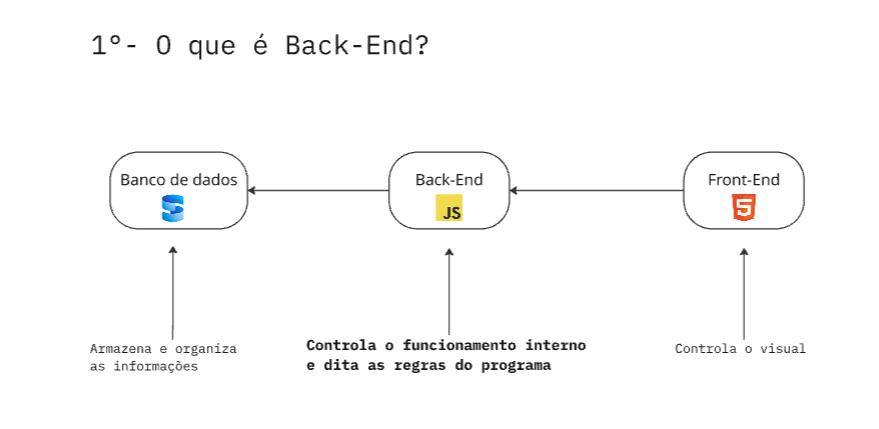
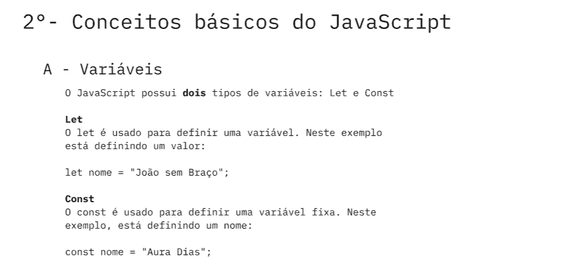
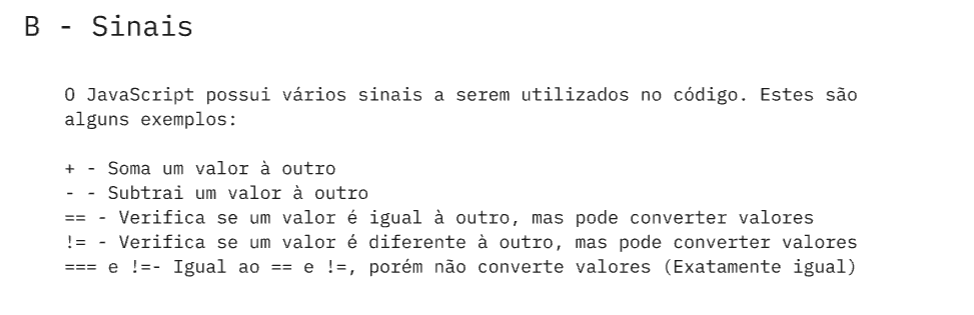
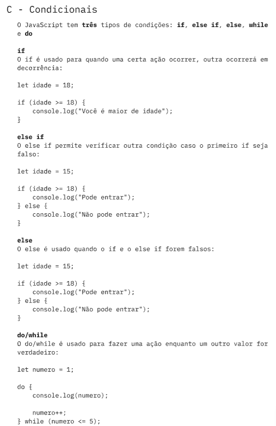
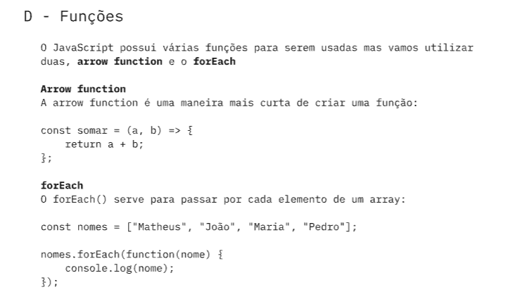

# Aula BackEnd

|Tecnologias|Descrição|
|--|--|
|[Miro](https://miro.com/)|Utilizado para o esquema conceitual|
|[Vscode](https://code.visualstudio.com/)|Utilizado para fazer os exemplos de programas|

 

|Contribuidores|Perfil|
|--|--|
|Matheus Dorigan Paiato|<a href="https://github.com/matheuszinpaiato-maker">Github|
|Leandro Imenes Oliveira|<a href="https://github.com/LeandroImenes">Github|

 

## Esquema de exemplo

## Atividade
Crie um arquivo no VS Code chamado mercado.js para um mercado que quer calcular o preço final de uma compra com 3 produtos. Se o preço final for maior que 200 reais, então o cartão não passa.

## Entrega
Envie a atividade pelo <a href="https://forms.cloud.microsoft/r/bhtgJ270Ec?origin=lprLink">Formulário
